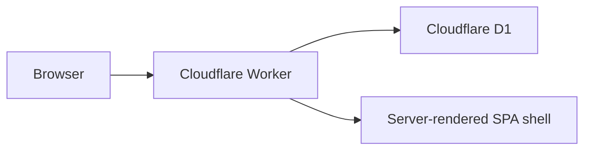

# BPM Portal MVP

Cloudflare Workers + D1 based BPM portal starter.

## Live Deployment

- Worker URL: https://bpm-portal.weiz30.workers.dev
- Cloudflare account: `2259832f71636dfcfad4aa9a1d61979d`
- D1 database: `bpm-portal-db`

## Current Features

- Login screen
- Portal dashboard showing logged-in user identity
- Announcements
- My messages
- System administrator role
- Employee role
- Custom role table
- Announcement owner role
- User account creation by system administrator
- Reserved entry points for message board, chat room, forum, knowledge base, and BPM workflow engine

## Demo Accounts

The Worker seeds demo data on first request.

- Admin: `admin` / `admin123`
- Employee: `employee` / `employee123`

Change these immediately after deployment if this becomes internet-facing.

## Cloudflare Setup

Install dependencies:

```bash
npm install
```

Create a D1 database:

```bash
npm run db:create
```

Copy the returned `database_id` into `wrangler.toml`.

Run schema on remote D1:

```bash
npm run db:migrate:remote
```

Deploy Worker:

```bash
npm run deploy
```

## Architecture



## Next BPM Steps

Recommended next entities:

- `forms`: form definitions and versions
- `workflow_templates`: process definition
- `workflow_nodes`: approval steps
- `workflow_instances`: submitted requests
- `workflow_tasks`: pending approvals
- `workflow_actions`: approve, reject, return, delegate
- `attachments`: files linked to requests
- `audit_logs`: immutable action history

## Security Notes

This MVP uses SHA-256 salted hashes for simplicity. For production, use a stronger password strategy, SSO, password reset, MFA, audit logging, and stricter session management.
